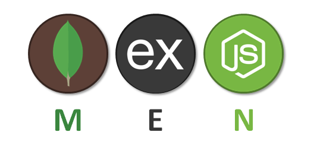

# TrackMyWarranties by MJ Felix


## Table of Contents

- [Description](#description)
- [Scope of Functionalities](#scope-of-functionalities)
  - [Pre-login](#pre-login)
  - [Post-login](#post-login)
- [Technologies/Components](#technologiescomponents)
- [Development Environment](#development-environment)
  - [Main Setup](#main-setup)
  - [Extended Setup](#extended-setup)
    - [AWS S3 Cloud Storage](#aws-s3-cloud-storage)
    - [SendGrid Service](#sendgrid-service)
    - [Google reCAPTCHA](#google-recaptcha)
- [Scheduled Email Notifications](#scheduled-email-notifications)
- [Code Formatting](#code-formatting)
- [Contact](#contact)

## Description

Add your warranties, upload your receipts and warranty cards, and receive automatic email notifications before the expiry date of the warranty.

Application is fully functional in production environment: [trackmywarranties.mjfelix.dev](https://trackmywarranties.mjfelix.dev)

## Scope of Functionalities

### Pre-login

- Login
- Registration
- Reset password

### Post-login

- See all warranties
- See warranty details
- Add warranty
- Update warranty
- Delete warranty
- Upload attachment to warranty
- Download attachment
- Delete attachment
- See profile + warranties/files stats
- Update email
- Automatic email notifications before warranty due date

## Technologies/Components



- Bootstrap 5
- Node.js
- Express.js
- Embedded JavaScript (EJS)
- MongoDB (Atlas)
- Amazon Web Services (AWS) S3
- MinIO (in development environment to mock AWS S3)
- SendGrid
- reCAPTCHA v2
- Others ([see package.json](https://github.com/mj-felix/track-my-warranties/blob/main/package.json))

Application is deployed on Heroku.

Selection of components was dictated by the Udemy course [The Web Developer Bootcamp 2001](https://www.udemy.com/course/the-web-developer-bootcamp/) from [Colt Steele](https://www.youtube.com/channel/UCrqAGUPPMOdo0jfQ6grikZw). The main difference is the replacement of Cloudinary by AWS S3 as a file storage component as well as the addition of SendGrid to send emails. Application uses free-for-hobbyist technologies.

In April 2021 application has been presented to the facilitator at [DevAcademy](https://devacademy.co.nz) which resulted in the author/developer being assessed as too advanced for the course and subsequently withdrawing from it.

After initial release of the application, refactoring of the code has been limited to only new functionalities.

Docker was introduced for development environment setup only a year after the initial release.

## Development Environment
### Main Setup

Development environment has been dockerized for ease of use.

After cloning the repository `git clone https://github.com/mj-felix/track-my-warranties.git` and changing into the main directory `cd track-my-warranties` it is enough to `npm run updev` (and then optionally `npm run logs` to access main application's logs).

Application will be served at [localhost:3000](http://localhost:3000/).

`npm run downdev` will shut down the development environment while persisting the data (database and uploaded files).

### Extended Setup

#### AWS S3 Cloud Storage

Development environment mocks AWS S3 using [MinIO](https://min.io) solution.

In order to access real AWS S3 bucket for file storage below environment variables need to be amended in `docker-compose-dev.yml`:

```
S3_ACCESS_KEY=key obtained from AWS S3
S3_ACCESS_SECRET=secret obtained from AWS S3
```

For AWS S3 setup, go to [aws.amazon.com/s3](https://aws.amazon.com/s3/) and create an account. Once the account has been set up, navigate to the S3 services dashboard to create a new bucket with the name as above. Allow all public access while creating a bucket. Once the bucket has been created, go to Permissions tab and set Bucket policy to be:

```
{
    "Version": "2012-10-17",
    "Statement": [
        {
            "Sid": "VisualEditor0",
            "Effect": "Allow",
            "Principal": "*",
            "Action": [
                "s3:PutObject",
                "s3:PutObjectAcl"
            ],
            "Resource": "arn:aws:s3:::track-my-warranties-dev/*"
        }
    ]
}
```

Turn off public access to the bucket.

To obtain access key and secret, open account dropdown and select “My Security Credentials”. Within the security credentials dashboard, open the “Access Keys” section and select “Create New Access Key.” This will generate the access key and secret for the application.

#### SendGrid Service

Development environment prints out emails to the console.

In order to send real emails below variables needs to be amended in `docker-compose-dev.yml`:

```
SENDGRID_API_KEY=key obtained from SendGrid
NO_RESPONSE_EMAIL=From email configured in SendGrid
```

There are 2 types of emails:
1. Reset password emails
2. Transactional emails:

   * email sent to Admin's email (set via `ADMIN_EMAIL` variable) on new user registration
   * notification emails about expiring warranty

For more information about SendGrid setup with Node.js see [the official SendGrid docs](https://sendgrid.com/docs/for-developers/sending-email/quickstart-nodejs/).

#### Google reCAPTCHA

Development environment ignores captcha.

In order to have captcha on new user registration form below variables needs to be amended in `docker-compose-dev.yml`:

```
RECAPTCHA_SITE_KEY=site key from Google reCaptcha
RECAPTCHA_SECRET_KEY=secret key from Google reCaptcha
```

For more information about Google reCAPTCHA see [the official Google reCAPTCHA developer's guide](https://developers.google.com/recaptcha/intro) or [create new reCAPTCHA](https://www.google.com/recaptcha/admin/create) - choose reCAPTCHA v2: "I'm not a robot" Checkbox and add `localhost` to Domains.

## Scheduled Email Notifications

Application sends automatic email notifications 1 week, 4 weeks and 12 weeks before the expiry date of the warranty.

In order to trigger these notifications in development environment run `npm run notifications` (after `npm run updev`).

In production environment, the application uses free [Heroku Scheduler](https://devcenter.heroku.com/articles/scheduler) plugin, which proved to be sufficient in terms of offered functionality.

## Code Formatting

JavaScript code can be formatted using `npm run format` (after `npm run updev`).

Embedded JavaScript (EJS) code can be checked using `npm run check-ejs` (after `npm run updev`). Any discovered errors will have to be fixed manually.

## Contact

MJ Felix<br>
[mjfelix.dev](https://mjfelix.dev)<br>
mjfelixdev@gmail.com<br>
[linkedin.com/in/mszonline](https://www.linkedin.com/in/mjfelix/) 
